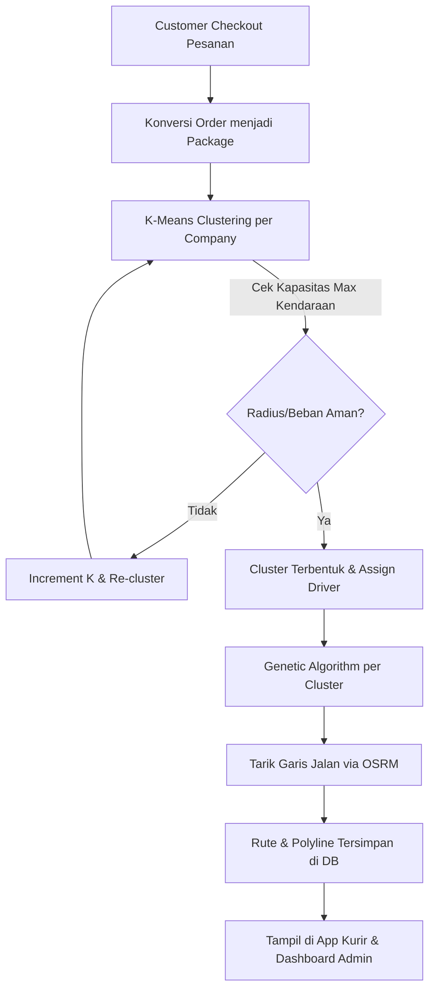

# ⚠️ Status Proyek: Dalam Pengembangan (Tertutup)
Kode sumber aplikasi ini belum bisa dibagikan kepada publik karena masih dalam tahap pengembangan tertutup.

# 🚚 PEMBUATAN SISTEM E-COMMERCE DAN LOGISTIK KATERING BERBASIS SAAS MENGGUNAKAN K-MEANS DAN ALGORITMA GENETIKA

Sistem informasi terintegrasi berbasis **Software as a Service (SaaS)** yang menggabungkan modul E-commerce (pemesanan) dengan mesin optimasi logistik cerdas. Aplikasi ini memecahkan masalah **Capacitated Vehicle Routing Problem (CVRP)** dengan membagi wilayah pengiriman secara otomatis kepada kurir dan menentukan urutan jalan paling efisien.

## 🗄️ Database Design (Not final)
https://drive.google.com/file/d/1lSgEp14MUMuscwvUtlJhSgiJsquDYq7O/view?usp=sharing

## 🏗️ Project Structure

```text
CVRP/
├── gui/                     # Expo React Native App (Front-end)
│   ├── mobile/              # React Mobile Dashboard - Untuk kurir dan customer
│   │   ├── app/             # App screens and navigation
│   │   ├── components/      # Reusable UI components
│   │   └── ...
│   └── web/                 # React Web Dashboard - Untuk Admin Tenant
├── nest/
│   └── vrp-backend/         # NestJS backend server (Back=end Engine)
│       ├── src/             # Logic Algoritma (K-Means, GA, OSRM) & Business API
            ├── auth/          # Khusus verifikasi dan autentikasi
            ├── tenant/        # Khusus Manajemen Akun Perusahaan (Company table) 
            ├── human/         # Khusus Manajemen Manusia 
            └── depot/         # Khusus Manajemen depot/cabang
            └── catalog/       # Khusus Manajemen katalog produk
            └── analytics/     # Menampilkan data dari tabel Order dan Package untuk dihitung.
            └── sales/         # Khusus menangani proses keranjang, dan pemesanan
            └── vrp/           # Khusus menangani kebutuhan logistik
            └── cust/          # Khusus Manajemen Pelanggan
│       ├── prisma/          # Database schema (PostgreSQL) - Multi-tenant structure
│       └── ...
└── README.md

```

## 🚀 Fitur Utama & Konsep Arsitektur

### 1. Arsitektur Multi-Tenant SaaS

Sistem dirancang agar dapat digunakan oleh banyak perusahaan (*Company/Tenant*) secara bersamaan dalam satu platform.

* **Isolasi Data (Data Privacy):** Setiap transaksi, data kurir, armada, dan paket dienkapsulasi menggunakan identifikasi `companyId`.
* **Depot Management:** Setiap perusahaan dapat mengelola *Depot* (titik awal keberangkatan/dapur utama) mereka sendiri secara dinamis.

### 2. Logistics Engine (Separation of Concerns)

Pemisahan tegas antara ranah transaksi dan operasional:

* **Domain Bisnis (Order):** Mengurus katalog produk, keranjang belanja, harga, dan riwayat transaksi (*E-commerce flow*).
* **Domain Logistik (Package):** Mengurus koordinat tujuan, berat (kg), volume (liter), dan status pengiriman. Data `Order` otomatis dikonversi menjadi `Package` yang siap dioptimasi, membuat *engine* K-Means & GA tetap bersih dan fokus pada perhitungan spasial.

### 3. Adaptive K-Means Clustering (Modified)

Tahap pengelompokan paket yang cerdas dengan mempertimbangkan dua aspek utama:

* **Capacity Constraint:** Menentukan jumlah cluster ($K$) awal berdasarkan rumus $\lceil Total Paket / Kapasitas Kurir \rceil$.
* **Spatial Radius Constraint:** Menggunakan **Haversine Formula** untuk menghitung radius cluster. Jika radius melebihi batas (misal > 7km), sistem akan melakukan *auto-increment* pada nilai $K$ untuk memecah wilayah agar beban kerja kurir tetap efisien.

### 4. Genetic Algorithm (Route Optimization)

Setelah paket terbagi per wilayah, GA bertugas mencari urutan kunjungan (*Permutation*) paling pendek:

* **Kromosom:** Representasi satu rute lengkap (Urutan ID Paket).
* **Ordered Crossover (OX):** Teknik perkawinan silang khusus untuk memastikan tidak ada paket yang dikunjungi dua kali atau terlewat.
* **Fitness Function:** Mengukur kualitas rute berdasarkan jarak rute asli yang ditarik dari API **OSRM** (Bukan sekadar garis lurus/Euclidean).

### 5. Multi-Platform Map Integration

* **Mobile (Kurir):** Memanfaatkan SDK Google Maps (via React Native Maps) untuk akurasi GPS real-time dan navigasi operasional jalan.
* **Web (Admin):** Menggunakan **Leaflet.js** sebagai solusi visualisasi ringan untuk menampilkan ratusan marker cluster beserta *polyline* rute di layar PC.

---

## 🗄️ Domain-Driven Database Schema

Database dibagi menjadi 3 pilar utama untuk menjaga *Clean Architecture*:

1. **Tenancy Domain:** `Tenant`, `Depot`, `Human`, `Product` (Infrastruktur SaaS).
2. **Transaction Domain:** `Customer`, `Order`, (Logika pemesanan).
3. **Logistics Domain:** `vrp` (Logika CVRP & Armada).

---

## 📊 Alur Kerja Sistem (End-to-End)


---

## 🛠️ Tech Stack

* **Backend:** NestJS, Prisma ORM, TypeScript.
* **Routing & Geo-API:** OSRM (Open Source Routing Machine), Haversine Formula.
* **Mobile & Web:** React Native (Expo), React.js, Leaflet.js, React Native Maps.
* **Database:** PostgreSQL (Relational & JSONB metadata).
* **Algorithms:** K-Means Clustering, Genetic Algorithm (Permutation-based).

---

**Developed by:** Franly Budi Pramana


